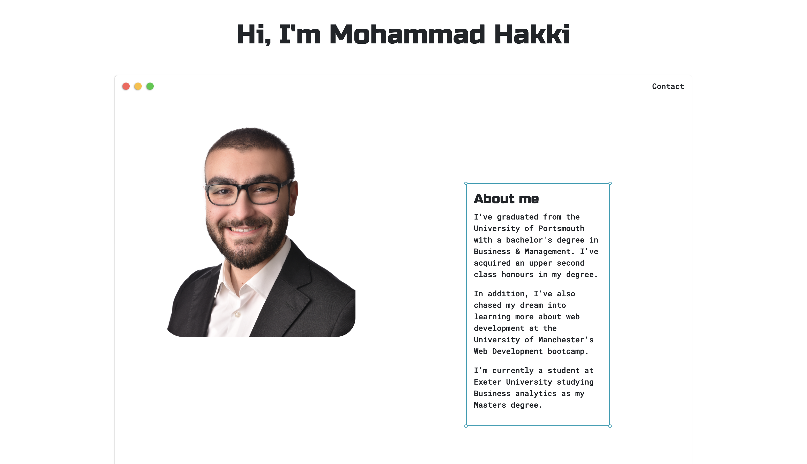

# Portfolio

## Description

Updated Portfolio page that shows all of my previous projects that I have worked on. In addition, my current skills and what are my ambitions and a downloadable link where employers can download my resume. Lastly, a contact email and form are provided so that future employers could contact me easily.

## What have we done

1. Added a recent photo of myself.
2. Added an about-me section which has a brief description about for the employer to see.
3. Added a work section to preview all the other projects I have worked on.
4. Provided a contact me section in order for the employer to contact me if needed.
5. Provided a responsive UI that adapts on various screens and devices.
6. When a specific section is clicked in a the navigation center then the UI scrolls to the corresponding section.

## Screenshot

## Link to the deployed application

You can view the deployed application [here](https://hakki1810.github.io/UpdatedPortfolio/)

## Link to the Github repository

You can access the Github repository [here](https://github.com/Hakki1810/UpdatedPortfolio).
